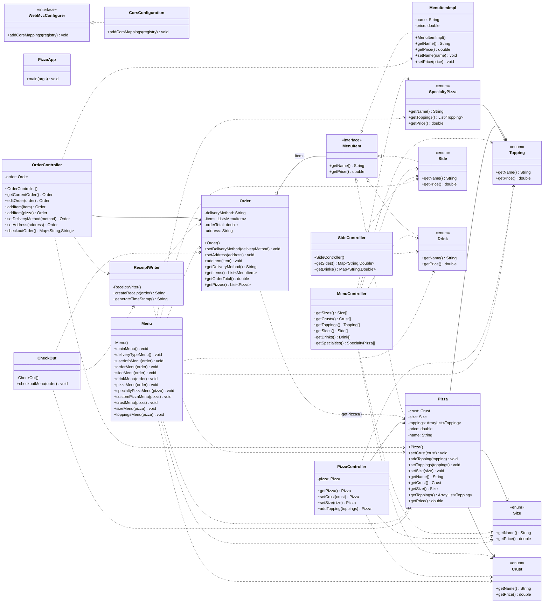
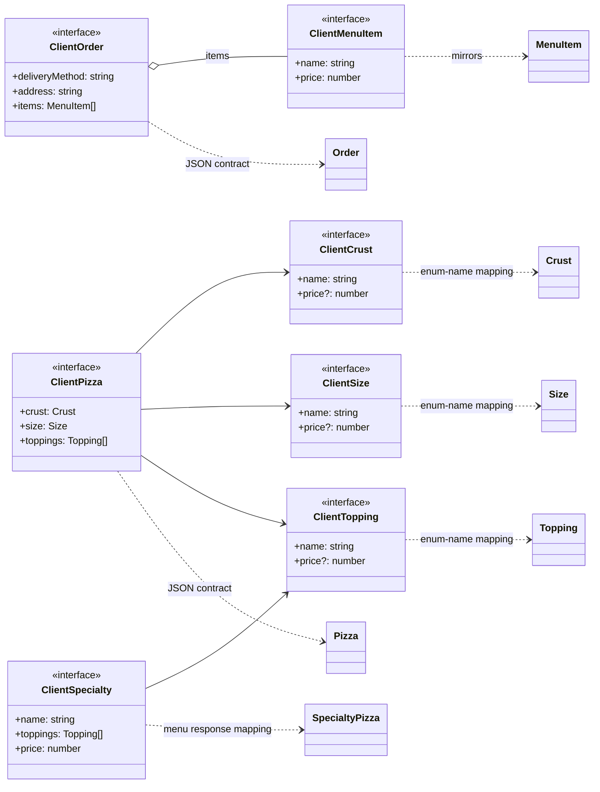

# Marcus Pizza

Marcus Pizza is a full-stack pizza ordering application with a React + TypeScript frontend and a Spring Boot backend. A user can browse specialty pizzas, build a custom pizza, add sides and drinks, review the cart, check out, and receive a generated receipt both in the UI and as a timestamped text file on disk.

## What This Project Does

- Serves a web storefront for pizza ordering.
- Lets users order specialty pizzas with selectable sizes.
- Lets users build custom pizzas with crust, size, and toppings.
- Lets users add drinks and sides to the same order.
- Tracks cart state in the frontend and order state in the backend.
- Generates a text receipt at checkout.

## Features

- React single-page app with routes for home, order, and custom pizza flows.
- Spring Boot REST API for menu data, pizza building, cart state, and checkout.
- Custom pizza builder with 5 crust options, 4 size options, and 15 toppings.
- Specialty pizza cards that default to regular crust and allow size selection before adding to cart.
- Checkout popup that displays the receipt returned by the backend.
- Receipt file generation in `server/src/main/resources/receipts/`.

## Tech Stack

| Layer | Technology |
| --- | --- |
| Frontend | React 19, TypeScript, Vite, React Router, Tailwind CSS |
| Backend | Java 17, Spring Boot, Spring Web MVC |
| Build Tools | npm, Maven |

## Menu

### Specialty Pizzas

Specialty pizzas use a regular crust by default. The base specialty price comes from the prices set by its parts.

| Pizza | Included Toppings | Base Price |
| --- | --- | --- |
| Pepperoni Extreme | Pepperoni, Pepperoni, Pepperoni | $10.50 |
| Hawaiian | Pineapple, Ham | $8.75 |
| Triple Meat | Pepperoni, Ham, Sausage | $10.75 |
| Margarita | Sun-Dried Tomatoes, Grilled Chicken, Spinach | $10.75 |

### Pizza Sizes

| Size | Price |
| --- | --- |
| Small - 8in | $0.00 |
| Medium - 12in | $2.00 |
| Large - 16in | $3.50 |
| X-Large - 20in | $4.99 |

### Pizza Crusts

| Crust | Price |
| --- | --- |
| Regular | $0.00 |
| Thin | $0.00 |
| Pan | $3.00 |
| Deep Dish | $4.00 |
| Stuffed | $6.00 |

### Toppings

| Topping | Price |
| --- | --- |
| Pepperoni | $1.50 |
| Sausage | $1.75 |
| Bacon | $2.00 |
| Grilled Chicken | $2.25 |
| Ham | $1.50 |
| Anchovies | $2.25 |
| Mushrooms | $0.75 |
| Onions | $0.75 |
| Extra Cheese | $1.00 |
| Green Peppers | $0.75 |
| Black Olives | $1.00 |
| Jalapeños | $0.75 |
| Pineapple | $1.25 |
| Spinach | $1.00 |
| Sun-Dried Tomatoes | $1.50 |

### Sides

| Side | Price |
| --- | --- |
| Garlic Bread | $4.50 |
| Cheese Bread | $6.99 |
| Buffalo Wings | $8.99 |
| Ranch Cup | $0.50 |

### Drinks

| Drink | Price |
| --- | --- |
| Most Pepsi Products | $2.99 |

## Project Structure

```text
marcus-pizza/
├── client/
│   ├── package.json
│   ├── public/
│   └── src/
│       ├── components/
│       ├── pages/
│       ├── providers/
│       ├── services/
│       └── types/
├── server/
│   ├── mvnw
│   ├── pom.xml
│   └── src/
│       ├── main/java/com/pluralsight/
│       │   ├── configuration/
│       │   ├── controllers/
│       │   ├── models/
│       │   ├── receipt/
│       │   └── ui/
│       └── main/resources/
│           └── receipts/
└── README.md
```

## Local Setup

### Prerequisites

- Git
- Node.js and npm
- Java 17

Maven does not need to be installed separately because the backend includes the Maven wrapper.

### 1. Clone the repository

```bash
git clone <your-repo-url>
cd pizza-parlor
```

### 2. Start the backend

Open a terminal in the `server` folder and run:

```bash
cd server
./mvnw spring-boot:run
```

On Windows:

```powershell
cd server
.\mvnw.cmd spring-boot:run
```

By default, Spring Boot will start on `http://localhost:8080`.

Important: run the backend from the `server` directory. The receipt writer uses a relative path and expects to write into `src/main/resources/receipts/` from there.

### 3. Create the client environment file

Open a second terminal, move into the `client` folder, and create a file named `.env`.

```bash
cd client
touch .env
```

Then place this variable inside the file (8080 is the default port I have):

```env
VITE_SERVER_BACKEND_URL=http://localhost:8080
```

That is the only client environment variable this project needs.

If your backend runs somewhere else, replace the value with that base URL instead.

### 4. Install client dependencies and start the frontend

From the `client` folder:

```bash
npm install
npm run dev
```

Vite will usually start on `http://localhost:5173`.

### 5. Open the app

Visit the frontend URL shown by Vite, usually:

```text
http://localhost:5173
```

## How to Use the App

1. Open the home page and click `Order Now`.
2. On the order page, browse the featured specialty pizzas or open the pizza, side, or drink popups.
3. For a custom pizza, choose `Create Custom Pizza`, then select a crust, a size, and any toppings you want.
4. Add as many pizzas, sides, and drinks as you want to the cart.
5. Open the cart and select `Checkout`.
6. The app will show the generated receipt and write a `.txt` receipt file on the backend.

## Frontend Notes

- The client uses React Router for `/`, `/order`, and `/order/custom`.
- `CartProvider` holds cart state, checkout visibility, and helper methods for adding items or pizzas.
- `menuService.ts` fetches menu data from the backend using `VITE_SERVER_BACKEND_URL`.
- `orderService.ts` handles order retrieval, item add, pizza add, and checkout.

## Backend Notes

- `MenuController` exposes menu data from enums.
- `PizzaController` builds a `Pizza` instance in memory across multiple requests.
- `OrderController` stores the active `Order` in memory and resets it after checkout.
- `ReceiptWriter` writes a timestamped file using the pattern `yyyyMMdd-HHmmss.txt`.
- `Menu` and `CheckOut` are legacy CLI classes still present in the codebase but not used by the React frontend.

## Diagram

The first diagram covers every Java class, interface, and enum in the backend source tree, including every declared method. The second diagram shows how the frontend TypeScript types map to the backend model contracts.





## Receipt Output

At checkout, the backend writes a text file to:

```text
server/src/main/resources/receipts/
```

Example filename format:

```text
20260529-023844.txt
```

The receipt includes:

- Each pizza with size, crust, toppings, and computed price.
- Each non-pizza menu item with its price.
- The final order total.

## Useful Commands

### Frontend

```bash
cd client
npm install
npm run dev
npm run build
npm run lint
```

### Backend

```bash
cd server
./mvnw spring-boot:run
./mvnw test
```

## Important Caveats

- The backend stores the current `Pizza` and `Order` in controller fields, so the current implementation is stateful and best suited for local development or single-user testing.
- `OrderController` resets the active order after checkout.
- `PizzaController` assumes a pizza has already been initialized through `GET /pizza/get` before the other pizza endpoints are used.
- The React app uses the `MenuController` endpoints for menu data. `SideController` still exists in the backend but is not the main path used by the frontend.

## Acknowledgments
This README was initially drafted with GitHub Copilot and then reviewed, edited, and verified by Marc Moten (myself).
documentation drafting assistance was provided by GitHub Copilot (GPT-5.4); the final content was edited and validated by the author.